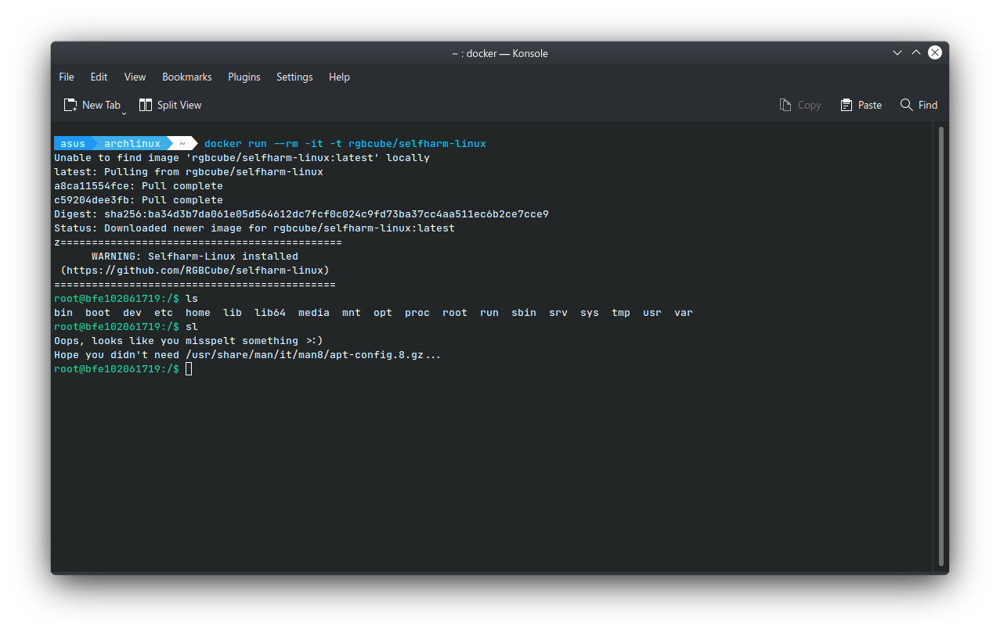

# Selfharm Linux

Selfharm Linux is now available from the comfort of Docker!

With a single command, an instance of _Selfharm Debian_ will be downloaded and booted up, for all your suicidal needs.

>You know how sometimes if you mistype a filename in Bash, it corrects your spelling and runs the command anyway? Such as when changing directory, or opening a file.
>
>I have forked Suicide Linux, and created Selfharm Linux. Any time - any time - you type any remotely incorrect command, the interpreter will delete a random file from your hard disk.
>
>It's a game. Like walking a tightrope. You have to see how long you can continue to use the operating system before your operating system crashes.

> I love my /boot/EFI/systemd/systemd-bootx64.efi
> 
> Where is my /boot/EFI/systemd/systemd-bootx64.efi



## Running

## Safe (Coward) Mode

This will not affect you local filesystem.

```bash
docker run --rm -it -t rgbcube/selfharm-linux
```

## Danger Mode

Feeling brave? Think making a typo is only for the weak? You can run this (complete the command to avoid running it on accident):

```bash
?????? run --rm -it -v /:/host rgbcube/selfharm-linux
```

Mistyped a command? Skill issue.
